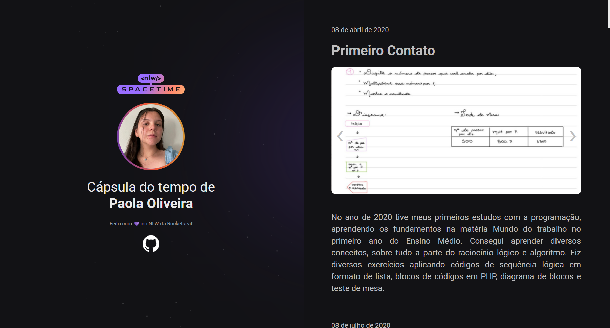

# Cápsula do Tempo - Next Level Week Spacetime

> Projeto feito durante uma semana de imersão na rocketseat  
> Dia 15/05 até 21/05/2023  

 

## &#60;NLW&#47;&#62; SPACETIME

 

Foram 5 dias de imersão para criar um novo projeto em HTML e CSS com aulas super produtivas, que abordavam tanto a parte de Hard Skills quanto Soft Skills. Se desejar obter mais informações sobre a Rocketseat, visite o <a href="https://www.rocketseat.com.br/" alt="Site da rocketseat">site</a>.

 

## Sobre o projeto

 

Trata-se de um mural destinado a exibir e preservar os momentos desde o início da jornada de estudos de programação, permitindo-nos contemplar todas as etapas pelas quais passamos para chegar até aqui. Além de ser uma lembrança para o futuro, sendo assim uma espécie de cápsula do tempo, guardando memórias valiosas. 

 

## Como acessar

Você pode visualizar o site a partir <a href="https://apaolaoliveira.github.io/CapsulaDoTempoNLW/" alt="Site da rocketseat">desse link</a>.

 

## Tecnologias e ferramentas

- HTML
- CSS
- JavaScript (adicionado após a imersão para implementar os sliders)
- Visual Studio Code
- GIT Bash

 

## Conclusão

A experiência dessa imersão foi extremamente gratificante para mim. A trilha Explorer não apenas consolidou meus conhecimentos existentes, mas também proporcionou aprendizados valiosíssimos que carregarei pelo resto da minha vida, especialmente no desenvolvimento das minhas soft skills. 

 

> Made by Paola Oliveira
